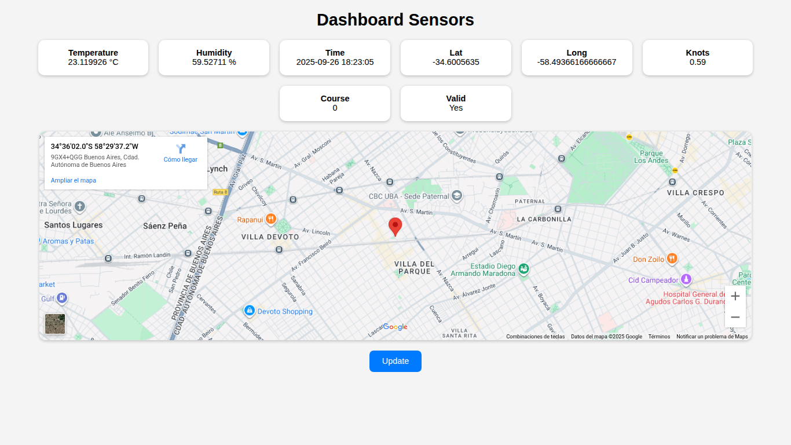

# About the Luckfox Pico board and Go example

This is an example of how to use a **Luckfox Pico** board with an application written in **Go**. The application allows you to read a GPS and an external sensor, as well as control an LED.


<!-- omit in toc -->
## Table of Contents

- [About the Luckfox Pico board and Go example](#about-the-luckfox-pico-board-and-go-example)
  - [Hardware requirements](#hardware-requirements)
  - [Software requirements](#software-requirements)
  - [Connections](#connections)
  - [SDK](#sdk)
  - [Burning image](#burning-image)
  - [Login](#login)
  - [Peripherals setup](#peripherals-setup)
  - [Compiling](#compiling)
  - [Running in the board](#running-in-the-board)
  - [Debugging](#debugging)
  - [Web server](#web-server)

## Hardware requirements

- Luckfox Pico Pro/Max board  
- GPS uBlox Neo-6M module  
- AHT10 Temperature and humidity sensor
- LED
- USB TTL serial conversor
- 5v Power supply (optional)
- Micro SD

## Software requirements

- Ubuntu 22.04
- Go 1.23+  
- VS Code + Go extension  
- Luckfox Pico Pro/Max SDK 

## Connections

- UART2 (Pin 1-2)     -> stdin/stdout
- UART3 (Pin 10-20)   -> GPS
- I2C0 (Pin 24-25)    -> AHT10
- GPIO1_C7 (Pin 4)    -> Led
- VSYS (Pin 39)       -> 5v


## SDK

Once you have purchased the Pico board, you need to download the SDK from the manufacturer's website and compile it. Since the SDK is built on Buildroot, it is possible to configure the rootfs and the kernel by executing these commands:

- ./build.sh buildrootconfig
- ./build.sh kernelconfig

Once the compilation is complete, which may take a long time the first time, the binaries are stored in the IMAGE folder.


## Burning image

In my case, to record the image, I used Windows. Before doing so, I had to install the following:

- RK DriverAssitant
- SocToolKit flashing tool

Then connect the board to a USB port and follow the detailed steps.

## Login

Although there are different ways to log in (adb-ssh-telnet), I used telnet, which is the simplest. 

- Turn on the device, in my case with an external 5V power supply
- Connect an Ethernet cable 
- Turn on the board
- Wait until DHCP assigns you an IP address. You can see the value of this ip address by running ifconfig


## Peripherals setup

In order to use peripherals, they must first be defined in the dts (device tree structure). This can be done:

- By compiling and modifying the corresponding dts files
- In real time, from the console running **luckfox-config**

By performing this last action, the change becomes permanent. In my case, I only had to configure the UART and I2C since the GPIOs are default.  


## Compiling

- To compile the project, simply run **make**
- If you need a build with debug information, use **make debug**


## Running in the board

To make things easier, I used the /tmp folder to copy and run the application. 

```go

package main

import (
	"log"
	"net/http"
)

func main() {
	// Serve static files from the current directory
	fs := http.FileServer(http.Dir("."))
	http.Handle("/", fs)

	// Start the server on port 8000
	log.Println("Serving on :8000")
	err := http.ListenAndServe(":8000", nil)
	if err != nil {
		log.Fatal(err)
	}
}
```
- On the host PC, you need to run a file server. Here is a simple example simulating Python's HTTPServer
- From the /tmp folder, run wget http://192.168.0.41:8000/sensor
- chmod a+x sensor
- ./sensor

## Debugging

In my personal experience, a development environment without a debugger is practically unworkable. In the case of Go, the most recommended debugger is Delve. From what I have been able to find out, Delve is not compatible with 32-bit ARM architecture, fortunately, I found this repository that provides compatibility with 32-bit ARM.

- Download the zip file from https://github.com/antoineco/delve/tree/arm32
- Uncompress the zip file
- Compile -> GOOS=linux GOARCH=arm GOARM=7 go build ./cmd/dlv

Once compiled, dlv can be copied directly to the /tmp folder with wget or added to the final image, to do the latter, you must do the following:

- Create this folder: "sdk/luckfox-pico/project/cfg/BoardConfig_IPC/overlay"
- Create this folder: "overlay/custom-overlay"
- Create the folder structure you want to replicate, for example “usr/bin”
- Copy dlv into this last folder
- Ensure that dlv has execution permissions
- Add to the file /sdk/luckfox-pico/project/cfg/BoardConfig_IPC/BoardConfig-XXXXX.mk -> export RK_POST_OVERLAY="custom-overlay"
- Rebuild rootfs
- Burn the new image

To run in debug mode, first edit the launch.json file from VSCode. 

```json
{
  // Use IntelliSense to learn about possible attributes.
  // Hover to view descriptions of existing attributes.
  // For more information, visit: https://go.microsoft.com/fwlink/?linkid=830387
  "version": "0.2.0",
  "configurations": [
    {
      "name": "Remote Go debbuging",
      "type": "go",
      "request": "attach",
      "mode": "remote",
      "remotePath": "${workspaceFolder}",
      "port": 2345,
      "host": "192.168.0.46",
      "showLog": true
    }
  ]

}
```
From the board, run the following command:

- dlv --listen=:2345 --headless=true --check-go-version=false --api-version=2 exec ./sensor


## Web server

It is possible to access GPS and sensor data through a web page that the application itself serves. 
<ip_pico_board:8080>

First, you need to copy the contents of the static folder to the micro SD card.

Copy static folder to -> /mnt/sdcard/static

