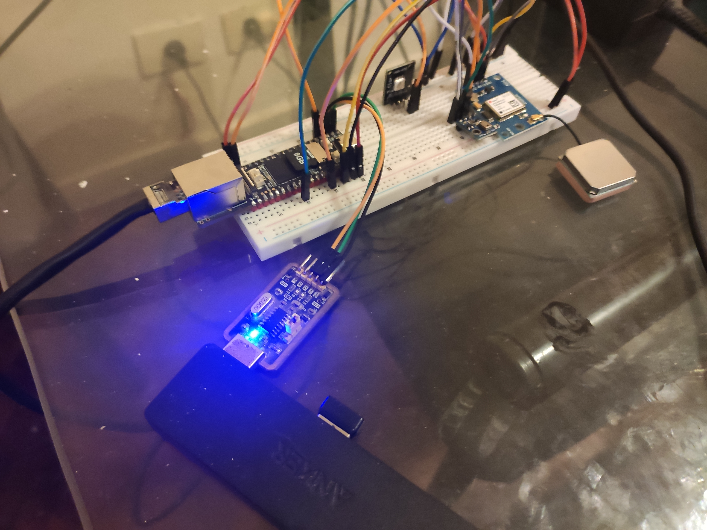

# Implementation Overview: Luckfox Pico Board with Go Application

This document outlines the procedure for utilizing the **Luckfox Pico** board with an application developed in **Go**. The application facilitates the acquisition of data from a GPS module and an external sensor, alongside the control of an onboard LED.



## Table of Contents

- [Implementation Overview: Luckfox Pico Board with Go Application](#implementation-overview-luckfox-pico-board-with-go-application)
  - [Table of Contents](#table-of-contents)
  - [Hardware Prerequisites](#hardware-prerequisites)
  - [Software Requirements](#software-requirements)
  - [Interconnect Diagram](#interconnect-diagram)
  - [SDK Configuration and Compilation](#sdk-configuration-and-compilation)
  - [Image Flashing Procedure](#image-flashing-procedure)
  - [Device Access and Login](#device-access-and-login)
  - [Peripheral Configuration](#peripheral-configuration)
  - [Application Compilation](#application-compilation)
  - [Execution on the Target Board](#execution-on-the-target-board)
  - [Remote Debugging Setup](#remote-debugging-setup)
  - [Integrated Web Server Functionality](#integrated-web-server-functionality)
  - [References and Resources](#references-and-resources)

---

## Hardware Prerequisites

- Luckfox Pico Pro/Max development board
- uBlox Neo-6M GPS module
- AHT10 Temperature and humidity sensor
- Light Emitting Diode (LED)
- USB-TTL serial converter
- 5V DC power supply (optional)
- Micro SD card

---

## Software Requirements

- Ubuntu 22.04 LTS operating system
- Go programming language environment (version 1.23+)
- VS Code integrated development environment (IDE) with the Go extension
- Luckfox Pico Pro/Max Software Development Kit (SDK)

---

## Interconnect Diagram

| Interface | Pins | Component | Function |
| :--- | :--- | :--- | :--- |
| UART2 | (Pin 1-2) | N/A | Standard Input/Output (stdin/stdout) |
| UART3 | (Pin 10-20) | GPS uBlox Neo-6M | Global Positioning System data link |
| I2C0 | (Pin 24-25) | AHT10 | Inter-Integrated Circuit sensor communication |
| GPIO1\_C7 | (Pin 4) | LED | General Purpose Input/Output control |
| VSYS | (Pin 39) | N/A | 5V Power Supply Rail |

---

## SDK Configuration and Compilation

Upon procurement of the Pico board, the **SDK** must be downloaded from the manufacturer's official repository and subsequently compiled. As the SDK is architected on **Buildroot**, the root filesystem and kernel can be configured by executing the following commands:

- `./build.sh buildrootconfig`
- `./build.sh kernelconfig`

Upon successful completion of the compilation process—which may entail a significant duration for the initial run—the resultant binary artifacts are stored within the `IMAGE` directory.

---

## Image Flashing Procedure

For the purpose of flashing the system image onto the board, the procedure was performed using a Windows host environment. Prior to the operation, the following utilities were required:

- RK DriverAssitant
- SocToolKit flashing utility

Subsequently, connect the board to a USB port and adhere to the detailed, step-by-step flashing instructions provided in the official documentation.

---

## Device Access and Login

While several methods for device access exist (e.g., ADB, SSH, Telnet, serial), **serial** was selected for its streamlined simplicity. The login process involves the following steps:

- Connectt USB-TTL serial converter to pin 1-2 (UART2)
- Power on the device, in this instance utilizing an external 5V power source.
- Open a serial terminal application, such as GTKTerm, and set connection parameters to 115200,N,8,1
- Wait until the boot finishes, then enter the username and password to log in

---

## Peripheral Configuration

To ensure the operability of external peripherals, their definitions must be specified within the **Device Tree Source** (`.dts`). This configuration can be achieved through two primary mechanisms:

- **Static Configuration:** Modifying and recompiling the corresponding `.dts` files within the kernel source.
- **Dynamic Configuration:** Configuring the parameters in real-time from the console by executing the `luckfox-config` utility.

Employing the latter method ensures the configuration changes are persistent across reboots. In this specific implementation, only the **UART** and **I2C** interfaces required configuration, as the **GPIO** settings utilize default values.

---

## Application Compilation

- To compile the project's release version, simply execute the `make` command.
- For a build incorporating debug symbols and information, use `make debug`.

---

## Execution on the Target Board

For ease of deployment and execution, the `/tmp` directory was leveraged for copying and running the application binary.

```go
package main

import (
  "log"
  "net/http"
)

func main() {
  // Serve static files from the current directory
  fs := http.FileServer(http.Dir("."))
  http.Handle("/", fs)

  // Start the server on port 8000
  log.Println("Serving on :8000")
  err := http.ListenAndServe(":8000", nil)
  if err != nil {
    log.Fatal(err)
  }
}
````

  - On the host machine, a file server must be initiated (a simple example simulating Python's `SimpleHTTPServer` is provided above).
  - From the target board's `/tmp` directory, use `wget http://192.168.0.41:8000/sensor` to download the binary, where 192.168.0.41 is the ip address of the host machine.
  - Grant execution permissions: `chmod a+x sensor`.
  - Execute the application: `./sensor`.

-----

## Remote Debugging Setup

A robust development workflow mandates the use of a debugger. For Go applications, **Delve** is the recommended tool. While Delve typically lacks native support for the 32-bit ARM architecture, a compatible repository was identified to bridge this gap.

  - Download the source ZIP file from the specialized branch: `https://github.com/antoineco/delve/tree/arm32`.
  - Decompress the archive.
  - Compile the debugger for the target architecture: `GOOS=linux GOARCH=arm GOARM=7 go build ./cmd/dlv`.

The resulting `dlv` binary can be transferred to the board via `wget` to the `/tmp` folder, or permanently integrated into the final system image. The integration procedure is as follows:

  - Create the following directory structure: `sdk/luckfox-pico/project/cfg/BoardConfig_IPC/overlay/custom-overlay`.
  - Within `custom-overlay`, replicate the desired target filesystem path, e.g., `usr/bin`.
  - Copy the compiled `dlv` binary into the designated target directory (`usr/bin`).
  - Verify that the `dlv` binary possesses execute permissions.
  - Append the following directive to the configuration file `/sdk/luckfox-pico/project/cfg/BoardConfig_IPC/BoardConfig-XXXXX.mk`: `export RK_POST_OVERLAY="custom-overlay"`.
  - Rebuild the root filesystem and flash the new image.

To commence a debug session, first configure the `launch.json` file in VS Code:

```json
{
  // Use IntelliSense to learn about possible attributes.
  // Hover to view descriptions of existing attributes.
  // For more information, visit: [https://go.microsoft.com/fwlink/?linkid=830387](https://go.microsoft.com/fwlink/?linkid=830387)
  "version": "0.2.0",
  "configurations": [
    {
      "name": "Remote Go Debugging",
      "type": "go",
      "request": "attach",
      "mode": "remote",
      "remotePath": "${workspaceFolder}",
      "port": 2345,
      "host": "192.168.0.46", // Target board IP address
      "showLog": true
    }
  ]

}
```

Initiate the debug server on the target board with the following command:

  - `dlv --listen=:2345 --headless=true --check-go-version=false --api-version=2 exec ./sensor`

-----

## Integrated Web Server Functionality

The application features an embedded web server, enabling access to the GPS and sensor data via a standard web interface at: `<ip_pico_board:8080>`.

Prior to access, the contents of the `static` folder must be copied to the Micro SD card:

Copy `static` folder to $\rightarrow$ `/mnt/sdcard/static`

-----

## References and Resources

[Manufacturer's Official Website](https://www.luckfox.com/EN-Luckfox-Pico-Plus?ci=531)

[Board Wiki and Documentation](https://wiki.luckfox.com/Luckfox-Pico-Pro-Max)

[Board SDK Repository](https://wiki.luckfox.com/Luckfox-Pico-Pro-Max/SDK)

[Image Flashing Guide](https://wiki.luckfox.com/Luckfox-Pico-Pro-Max/Flash-image)

[Device Tree Source Documentation](https://wiki.luckfox.com/Luckfox-Pico-Pro-Max/Device-Tree)

[Device Login Procedures](https://wiki.luckfox.com/Luckfox-Pico-Pro-Max/Login)

[Guide: Packaging Custom Files into the System Image](https://wiki.luckfox.com/Luckfox-Pico-RV1106/Luckfox-Pico-86-Panel/SDK/#3-packaging-custom-files-into-the-system-image)

[Delve ARM32 Compatibility Repository](https://github.com/antoineco/delve/tree/arm32)
